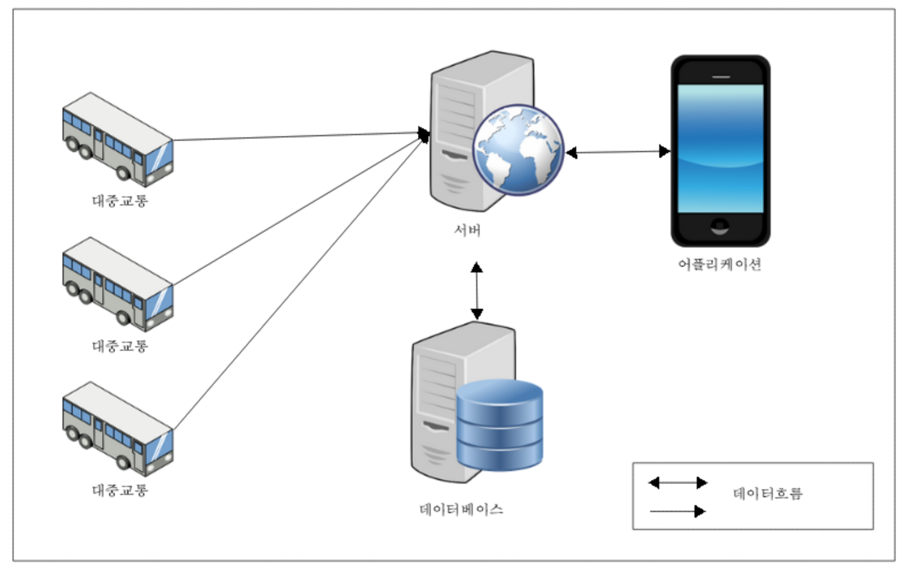

# PTIMS_ASP_Webserver
ASP WebServer for Public Transportation Intensity Measuring Systems

온습도 센서와 이산화탄소 센서를 활용한 대중교통 혼잡도 측정 시스템

Public Transportation Intensity Measuring Systems(PTIMS) Using Temperature-Humidity Sensor And Cardon Dioxide Sensor

아두이노 소스 : https://github.com/OnionLord/PTIMS_Arduino
테스트 애플리케이션 소스 : https://github.com/OnionLord/PTIMS_Android_Test

서버
 1. 각 대중교통에 설치된 아두이노로부터 데이터를 가져옴
 2. 가져온 데이터를 데이터베이스에 저장한다.
 3. 어플리케이션의 데이터 요청시 
	서버는 데이터베이스로부터 데이터를 가져와서 어플리케이션에 제공

서버와 데이터베이스간 주고 받는 데이터형식

busno : 버스 차량 번호 (차량정보)
lineno : 버스 노선 번호 (차량정보)
busURL : 버스에 설치된 아두이노의 URL (차량정보)
thi : 혼잡 기준 불쾌지수 (차량정보)
co2_density : 혼잡 기준 이산화탄소 농도 (차량정보)
temperature : 아두이노 센서로부터 측정된 온도 
humidity : 아두이노 센서로부터 측정된 습도
co2 : 아두이노 센서로부터 측정된 이산화탄소 농도

어플리케이션이 요청시 혼잡을 판단하여 어플리케이션에 제공가능
judge 값 – congestion : 혼잡 / normal : 정상

데이터베이스 : mongoDB 사용

